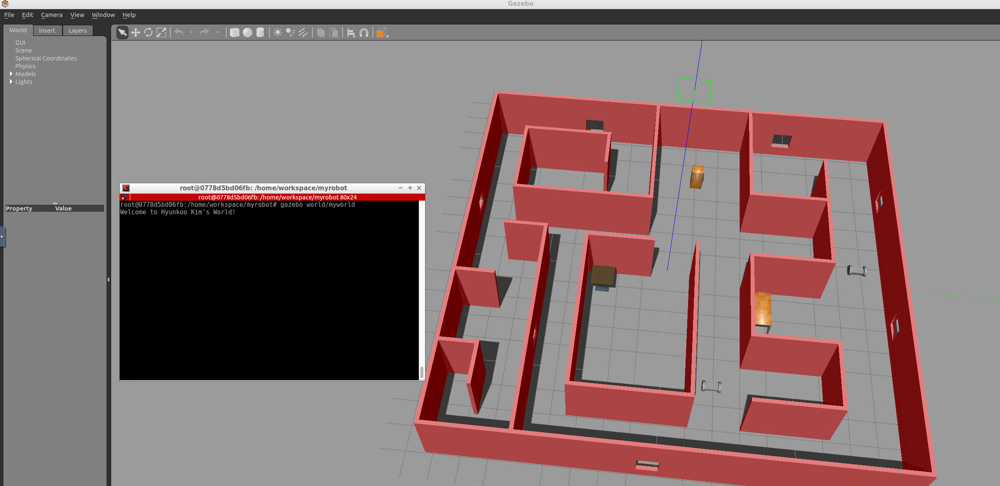

[](https://www.udacity.com/robotics)

# RoboND-myrobot
The **myrobot** lab part of RoboND Gazebo Basics lesson. The purpose of this lab is to learn how to build a two-wheeled robot model with the Model Editor tool in Gazebo. Include this model in an empty Gazebo World. And, finally write a plugin to interact with this world.  

### Directory Structure
```
    .myrobot                           # RoboND Project1: Build My World 
    ├── images                         # Code output image                   
    │   └── output.png
    ├── model                          # Model files of the two-wheeled robot
    │   ├── Building
    │   │   ├── model.config
    │   │   └── model.sdf
    │   ├── myrobot
    │   │   ├── model.config
    │   │   └── model.sdf
    ├── script                         # Gazebo World plugin C++ script      
    │   └── welcome.cpp
    ├── world                          # Gazebo main World empty scene
    │   └── myworld
    └── CMakeLists.txt                 # Link libraries             
```

### Steps to launch the simulation

#### Step 1 Update and upgrade the Workspace image
```sh
$ sudo apt-get update && sudo apt-get upgrade -y 
```

#### Step 2 Clone the lab folder in /home/workspace/
```sh
$ cd /home/workspace/
$ git clone https://github.com/studian/RoboND-P1-BuildMyWorld myrobot
```

#### Step 3 Compile the code
```sh
$ cd /home/workspace/myrobot/
$ mkdir build
$ cd build/
$ cmake ../
$ make
```

#### Step 4 Add the library path to the Gazebo plugin path  
```sh
$ export GAZEBO_PLUGIN_PATH=${GAZEBO_PLUGIN_PATH}:/home/workspace/myrobot/build
```

#### Step 5 Run the Gazebo World file  
```sh
$ cd /home/workspace/myrobot/
$ gazebo world/myworld
```

### Output
The hello world message and the two-wheeled robot inside a Gazebo World should both launch as follow: 


### Evaluation
Once you finish designing your world in Gazebo, check the Project Rubric to see if your world meets the specifications. If so, then you are ready to submit!
[Project Rubric](https://review.udacity.com/#!/rubrics/2346/view)


    
 
